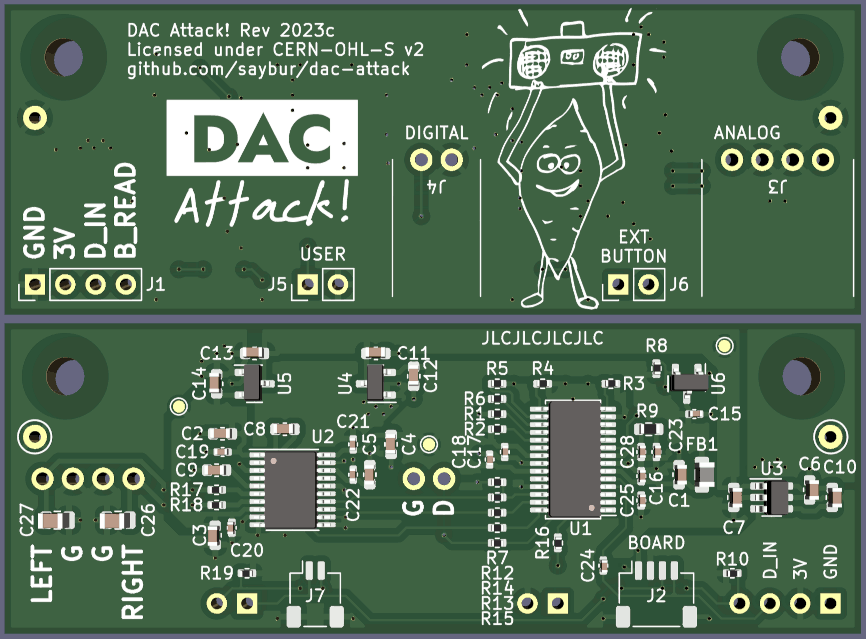
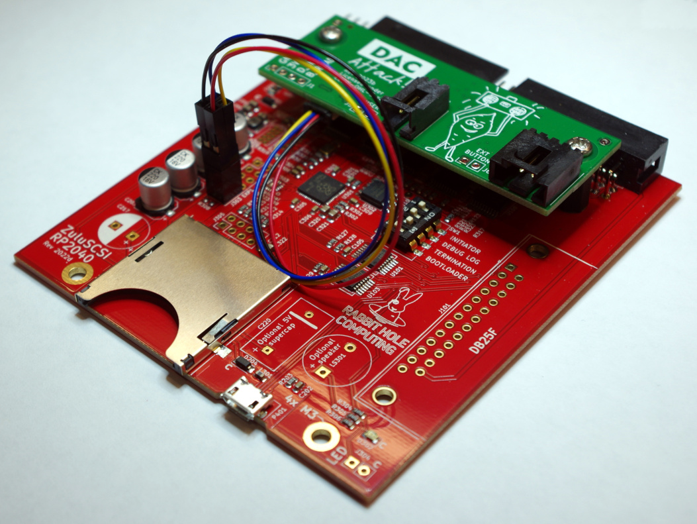

DAC Attack!
===========

A small [S/PDIF](https://en.wikipedia.org/wiki/S/PDIF) to
[line-level](https://en.wikipedia.org/wiki/Line_level) audio adapter design.
The intended use case is with some versions of
[ZuluSCSI](https://zuluscsi.com/), though the design should work with any
S/PDIF compatible output source generating a TTL-compatible signal.

Used with a compatible board, and the appropriate firmware, this allows sending
audio to a retro computer. See later sections for usage information.

As of this writing, only some ZuluSCSI variants offer audio output. This list
may change in the future. Refer to the ZuluSCSI project page for details about
audio output support.

License and Disclaimer
----------------------

This project is made available under the CERN Open Hardware Licence
strongly-reciprocal variant version 2, available at [LICENSE](LICENSE).

This source is distributed WITHOUT ANY EXPRESS OR IMPLIED WARRANTY, INCLUDING
OF MERCHANTABILITY, SATISFACTORY QUALITY AND FITNESS FOR A PARTICULAR PURPOSE.
Please see the CERN-OHL-S v2 for applicable conditions.

ZuluSCSI&trade; is a registered trademark of Rabbit Hole Computing&trade;, used
with permission.

Assembly
--------

The author has had JLCPCB assemble these boards as prototypes. The files
`dac-attack-bom.csv` and `dac-attack-top-pos.csv` files were used successfully,
though caution should still be excercised: other open-source hardware projects
have reported some inconsistency in individual orders using files like these.

Adding through-hole components to assembled boards is relatively
straightforward. The choice of what connectors to solder is up to the user:

- 'analog' provides standard line-level output for sending to a sound card.
- 'digital' provides TTL-level S/PDIF from the CS8416 chip, which should
  _theoretically_ be suitable for sending to a sound card with a digital-in
  connector, ~~those this use case is NOT TESTED~~ florian3 on Vogons reports
  this is working fine, thanks for testing!
- 'ext button' provides a place to attach a button for the **B_READ** line.
- 'user' is connected to the U pin of the CS8416. This feature is not tested
  and this pad can be left vacant.
- The four pads for **G**, **3V**, **D_IN**, and **B_READ** are available if
  you do not want to use the modular connector. See the later section for
  hookup information.

Part numbers for through-hole parts are in [bom-full.csv](bom-full.csv).

Installation
------------

The screw holes on the board are spaced to match a 2.5" hard drive, which is
the same pattern on most ZuluSCSI boards. Use standoffs to prevent shorting
connections. An example mount is shown below. The full BOM has some options,
which you can probably also find at your local hardware store or a convenient
online retailer.

Most parent boards use either a 0.1" holes _or_ a matching 4-pin modular
connector. Instructions vary between these two board types.

__Important note:__ DAC Attack uses a 4-pin connector that matches common
hobbyist I2C formats; however, the board is __not compatible__ with I2C.

### 0.1 Connectors

**Carefully** solder a socket on the parent board. Most will need either a 2x2
or 1x4 connector for this. Example parts to order are in the BOM. You only need
to solder to points labeled **GND**, **3V0**, **SCL**, and **SDA** on the
bottom of the board. Again, use great care during this process to avoid
damaging anything.

Once soldered, connect a suitable cable from the socket to the DAC's modular
connector. Potential options are listed in the BOM. If the DAC's modular
connector is not populated, or you would prefer not to use it, the separate
labeled points on the DAC may be used instead.

If using the modular cable pin breakout version, colors should correspond as
follows:

- Black: GND
- Red: VCC (3V)
- Blue: B_READ ('SDA' label)
- Yellow: D_IN ('SCL' label)

### Modular Connector

If your parent board is equipped with a 1x4 modular connector, you're all set:
just connect the board to the DAC.

If the parent board does not have a modular connector, the most straightforward
option is to add the modular connector, likely part _BM04B-SRSS-TB(LF)(SN)_.

Cabling
-------

Once you have installed the board and applied correct firmware (if needed), all
that remains is connecting the 'analog' port to a suitable target. Most period-
correct sound cards will use either a 3-pin or 4-pin cable for connecting a CD
drive. This pinout is also compatible with the one used on retro Mac computers.

It is recommended to test your configuration to determine if stereo audio is
being handled appropriately. If it is not, rotate the cable in the socket.
